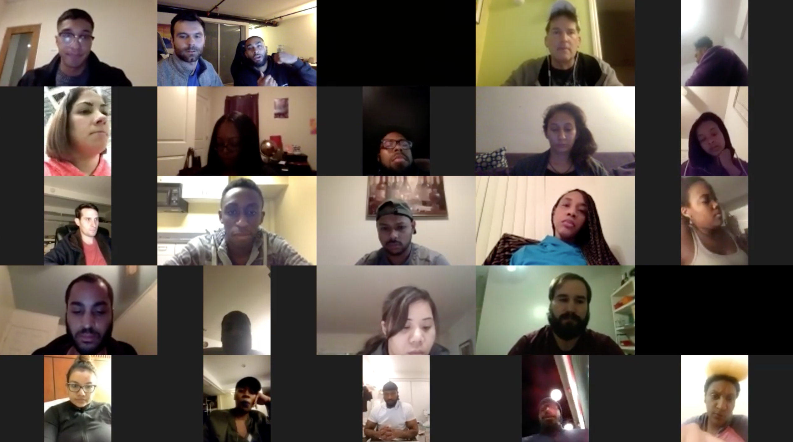

# \#21DayCkChallenge

Warning: the following challenge contains steps that involve working with other people, holding each other accountable and may lead to a career transition that will result in a six figure income

## Welcome

Over the next 21 days, you will participate in a challenge that will unlock a **Career Transitioner Blueprint** to be used in 2019 in order to take the next step to a dream career you've always wanted.

Along the way, you will push yourself outside your comfort zone, make some new friends and learn some code. 

## Three Main Rules 

1. Directly Message at least 2 people each day on Career Karma by initiating a conversation to ask them how they're planning to break into tech in 2019 
2. Create a Twitter post about people you meet each week, bootcamps you're interested in or your progress for the week using the \#21DayCkChallenge hashtag 
3. Attend 1 Career Karma workshop a week over the next 3 weeks to create your personalize Career Transitioner Blueprint 

## Commitment

When you begin this challenge, publicly announce your participating on Twitter with the \#21DayCkChallenge hashtag. 

This will enable our online community can hold you accountable. 

Create a post in your Peer Circle about your dream job, salary and company. **Sky is the limit!**

It might seem intimidating... but by clicking here to share your tweet you are making a promise to yourself that this is going to be the year where you take control.

##  The Why

We've seen countless people complete this career transition and not a single person did it all on their own.

Each of the rules above, were tailored to push you outside of your comfort zone in a unique way. 

We specifically want you to get to know people at your stage and people at a stage ahead of you who will provide personalized guidance. 

We also chose Twitter for a reason. Twitter is a tool that will give you leverage in your bootcamp or job interviews, open doors to new opportunities and help establish your brand.

In case you missed it, here you can watch the Launch Video with CK's community:

[https://youtu.be/BdmY4Tj0EII](https://youtu.be/BdmY4Tj0EII)

## Next Steps 

1. Announce your commitment in your Peer Circle and [**publicly on twitter here**](https://twitter.com/intent/tweet?url=https%3A%2F%2Fsmarturl.it%2F21DayCkChallenge&text=I%27m%20publicly%20committing%20to%20the%2021DayCkChallenge%20to%20take%20control%20of%20my%20career%21%20Find%20out%20more%20and%20Join%20me%21&hashtags=21DayCkChallenge)**.** 
2. Sign-up for the first workshop called [_**Orientation**_](https://smarturl.it/ck-orientation) or the second workshop called [_**Basic Training**_](https://smarturl.it/ck-basic-training). 
3. If you haven't been added to a new Peer Circle, post which bootcamp prep course you're taking on the [Career Karma app](https://smarturl.it/downloadCkTimur) and we'll match you to people learning similar technologies. 
4. Obtain additional details on the [**Challenge Guidelines here.** ](challenge-guidelines.md)\*\*\*\*

## **Can I join the challenge?**

If you're not yet part of Career Karma's community but you're interested in learning how to code please [download our free mobile app here](https://smarturl.it/downloadCkTimur). 

One you register, you will encounter peers from all over U.S. who are helping one another become software engineers. 

