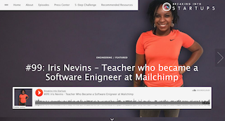

# Phase 1: Join a Community

**Peer Circles:**

You will meet other learners in your Peer Circles. A Peer Circle is a group of people who share a common goal of becoming software engineers within 6-12 months. This is your squad!

Each week you will be invited to attend a live conference call with someone who is a current bootcamp student or a graduate. Please RSVP for your first one here.

Please watch previously recorded interviews with guest speakers who share their stories and strategies below. Pay close attention to the questions that your peers are asking and the guest speaker's responses for live feedback.

[Jordan Jackson - Transitioned from the Airforce to a Software Engineer at Twitter](https://drive.google.com/file/d/1j87DSymAxhZMLzSopEBHydgHK6T_cXxc/view?usp=sharing)

[Madelyn Tavarez - completed a part-time bootcamp and landed an apprenticeship at Pinterest](https://drive.google.com/file/d/1-4UlSLfBJNbQZ6-CG7QeF9ED6QYsjqEo/view?usp=sharing)

[Rich Smith - Dropped out of college and became a Senior Engineer at Netflix](https://drive.google.com/file/d/18HisDmwFdifEeOyfd6FFMUR2-FL4jf47/view?usp=sharing)

**Success stories:**

[Teacher who became a Software Engineer at Mailchimp ](https://breakingintostartups.com/iris-nevins-engineer-mailchimp-2/)

[How a professional poker player, with no college degree, got a job at Airbnb as a software engineer](https://breakingintostartups.com/haseeq-qureshi-software-engineer-professional-poker-player/)

[How a US army captain became a software engineer at Snapchat after attending a remote bootcamp](https://breakingintostartups.com/71-jon-deng-u-s-army-captain-became-software-engineer-snapchat/)

**Tutorials:**

[Get started with this JavaScript intro course](https://www.codecademy.com/learn/introduction-to-javascript?utm_source=google&utm_medium=adwords&utm_campaign=tm&utm_content=tm_javascript&utm_term=%2Bcodecademy%20%2Bjavascript&gclid=Cj0KCQjww8jcBRDZARIsAJGCSGu3mbP3AjJkLTWhnhXRGlbboIcW0x2eolFXAyb1l5Wbx41u1wpq6jUaAlS7EALw_wcB)

**What you should of learned:**

* How other peers successfully transitioned to software engineering roles
* What paths you can take to become a software engineer
* Introduction to JavaScript 

