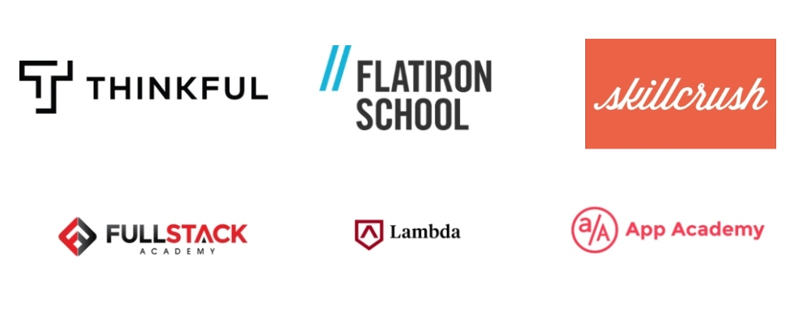

# Phase 2: Research Educational Programs

[A day in the life as a bootcamp student](https://www.youtube.com/watch?v=AvASMtTfR-8)

#### Factors to consider when choosing a bootcamp:

* **Time commitment** - Bootcamps typically offer in person full-time, in person part-time, online full-time, online part-time, and self paced programs
* **Locations** - Bootcamps are located in various cities across the US and typically offer online options as well
* **Length of bootcamp** - Bootcamps can range from 3 months - 1 year and some offer self-paced options
* **Tuition** - Bootcamps have various ways of helping students finance their program. Some bootcamps do not charge tuition until they help you get a job \(known as deferred tuition or an income sharing agreement\)

**Refer to the chart below to help you shortlist some bootcamps to consider:**

#### Research top 2-3 bootcamps:

Based on the information above, select 2-3 bootcamps that fit your schedule, financing and learning style to explore further. The goal is to learn more about the various options and formats available to you.

**Here are the links to their websites:**

* [Lambda School](https://lambda-school.sjv.io/7xEd5)
* [App Academy](https://apply.appacademy.io/careerkarma-app-academy/)
* [Hack Reactor](https://getcoding.hackreactor.com/bis/)
* [Thinkful](https://getstarted.thinkful.com/partnerships/career-karma-thinkful-engineering-course)
* [Flatiron School](https://flatironschool.com/?utm_source=careerkarma&utm_medium=social)
* [Rithm School](https://smarturl.it/rithm_school_home)

#### Leverage LinkedIn:

* **We encourage you to look up alumni of the different bootcamps on LinkedIn to see where they're working**
  * Search the bootcamp by name on LinkedIn, click _see alumni,_ filter by where they work
  * For each of your choices, find 1-2 people and reach out to them via Linkedin

#### Leverage the peer circle:

Everyone in your peer circle is also working to understand which path best suits their unique situations. You might have discovered new or you may have some hesitations.

* Share something you didn't know before that you learned with your peer circle
* Share one of your hesitations with your peers and hear them out
* Chances are someone has had the EXACT SAME concerns and they might help you see a different perspective. Connect with your peers!

#### Pick your top bootcamp choice and get started with prep material:

At this stage we suggest you pick a free bootcamp prep course to take so you can keep learning in a structured manner.

Although there are a lot of tutorials on Udemy and Google, we believe the prep courses were designed to help someone get started and will ensure you're working towards your end goal.

The mistake we see a lot of people make is taking various tutorials without knowing exactly how that translates into acquiring the needed skills to find a job or get accepted into a coding program.

Here is a list of free prep course that you can take:

* [Lambda School intro to web development](http://smarturl.it/Lambda-School-prep)
* [Flatiron Bootcamp prep](https://flatironschool.com/free-courses/coding-bootcamp-prep/?utm_source=careerkarma&utm_medium=social)
* [Hack Reactor SSP Program](http://smarturl.it/Hack-Reactor-prep)
* [Thinkful apply for prep](http://smarturl.it/Thinkful)
* [App Academy apply for prep](https://smarturl.it/app-academy-prep-ck)

**Optional:**

[Listen to the interview with the founder of App Academy](https://breakingintostartups.com/kush-patel-founder-of-app-academy/)

[Listen to the interview with the founder of Hack Reactor](https://breakingintostartups.com/shawn-drost-founder-hack-reactor/)

[Listen to the interview with CEO of Treehouse](https://breakingintostartups.com/ryan-carson-ceo-treehouse/)

## 

