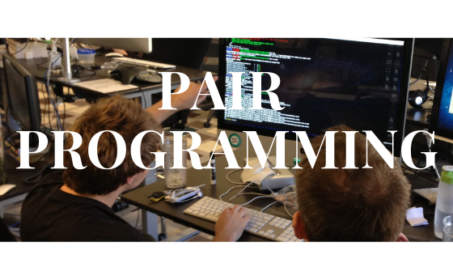
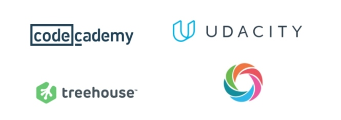

# Pair Programming

## What is Pair Programing?

Pair Programing is a practice of... you guessed it. Programming in pairs! 

But there is a lot more. 

Pair Programming is a way for you to work and discuss a challenge with your partner. 

It's a chance for you to see your partners approach. 

And a chance for you to articulate and share your approach with your partner. 

It's also a great way to see if you really understand a programming concept. 

There is no better way to see if you know a concept than to try teaching it to someone else. 


More often than not by teaching others you push yourself to think of examples and analogies that help you formulate and solidify your mental model around a coding concept.


In the real world you will be working on teams. 

So why not simulate that same environment when you're learning?

Our point is that it's a really useful practice that we have seen work for ourselves and our community members who broke in. 

With Career Karma we created a way for everyone in our community in Peer Circles to do the same.

## Getting Started with Pair Programming

By becoming a member of a Career Karma Peer Circle, you now have access to signup for Pair Programing sessions so you can start learning in pairs. 

Here is the overview of the process to begin Pair Programing: 

* **Signup** for a Pair Programing Session \(you will see a link to a form 'Pinned' at the top of your chat\)
* **Connect** with your Pair and pick a date and time that works for both of you
* **Choose** a challenge \(ranging easy - medium - hard\) that you and your partner will tackle
* **Pair Program** \([Here are detailed instructions on how to Pair Program](https://career-karma.gitbook.io/learn/preparing-for-a-bootcamp/pair-programming#pair-programming-instructions)\)
* **Share** your results; we encourage you to share screenshots, code snippets and feedback with your peer circles after you're done 
* **Solutions** \(we created solutions to challenges that you can reference once you're done\)

We recommend that before attempting to Pair Program you spend 5-10 hours familiarizing yourself with basic HTML, CSS or JavaScript fundamentals to get prepare. 

1. [Free HTML course on Codecademy ](https://www.codecademy.com/learn/learn-html?utm_source=careerkarma&utm_param=careerkarma)

2. [Free CSS course on Codecademy](https://www.codecademy.com/learn/learn-css?utm_source=careerkarma&utm_param=careerkarma)

3. [Learn HTML, CSS & JavaScript on the go with SoloLearn](https://www.sololearn.com?utm_source=careerkarma&utm_params=careerkarma)

4.[ Learn JavaScript from Team Treehouse](https://bit.ly/2gFMjGH) 

5. [Free JavaScript course on Udacity](https://www.udacity.com/course/intro-to-javascript--ud803?utm_source=careerkarma)

## Selecting a Challenge

To help you get started, once you're assigned a pair, we've put together challenges you can do through a shared coding editor. 

We realize that in most cases you will be Pair Programming virtually so we designed an experience that can be done completely remote. 

Here are the **3 sample challenges** you can choose from: 

1. [Build HTML & CSS Page](https://codesandbox.io/s/xjnpr97v04) \(Easy\)
2. [HTML & CSS Animations](https://codesandbox.io/s/m46r81ykqx) \(Medium\)
3. [Javascript Into Algorithm toy problem](https://codesandbox.io/s/9ov7j0k48o) \(Easy\)

Basically, you'll be able to decide what problem your pair wants to tackle and you'll have access to the same workspace. \(Run in your browser\)

## Pair Programming Instructions 

Now here comes the fun part. 

**To begin** pair programing, you need to start off by understanding the roles in each pair:

**Driver**

**Navigator** 

The driver is one of the two roles in your pair who will be responsible for typing and writing the code. 

Here is the catch. 

**The driver cannot just write code.** 

They are only allowed to write code dictated by **the Navigator**. 

**The Navigator cannot just get on the keyboard and type.** 

The Navigator is tasked with explaining their logic and approach to the driver so the driver knows what needs to be typed. 

In the process of pair programming you will see that both parties will be discussing and brainstorming the best approach. 

The key part in pair programming is that **both programmers switch roles every 15-minutes**. 

This means your role will switch between driving and navigating. 

You will learn how to work with others. 

How your peers think. 

How they approach different problem solving. 

What they do to solve problems efficiently. 

Our point is... 

You will not just learn more about programming, but you will learn a lot about yourself and you will develop strong problem solving skills. 

## The Setup: 

Here are three reasons we're excited:

1. You will get to use [CodeSandbox](https://docs.google.com/document/d/1N3Iv3C3SFye1hrGRR81Fj51S6tfRe6bPHtRAb-x3nT0/edit?usp=sharing) which is a tool that will allow you to type your code in your browser and your partners screen will update with each key stroke. \(And vise-versa\) 

This way you'll truly have a 'Virtual Pair Programming' environment and you'll be set-up to begin working in no time. 

2. Your pair programing projects will seamlessly be stored on Github. 

This means you can create a Github account and begin building your reputation as a software engineer. 

Github is a place where most engineering teams store their code. 

As you store your code it will also track your progress and activity. 

As you practice and become a better developer, you're account gets more commits. 

This will eventually help you **stand out when you're applying for jobs** in a few months from now!

\(Here are the [instructions on how to create a Github account](https://docs.google.com/document/d/1oBhKoEanwGkfyqHwXlybkTEFdSX_f0xFRMffMuQ6Us8/edit?usp=sharing) if you don't already have one\) 

3. You will be learning, teaching and practicing coding challenges with a friend.

We know you might be paired with someone who know a little bit more or less than you. 

That's Ok!

Use this as an opportunity to see how someone else approaches their unique way of solving a problem. 

At the end of the Pair Programing session we'll be asking each pair to post screen shots of the deliverable and feedback!

This will be a great way to build up your reputation in your peer circle & KARMA!

## Solutions

Proceed with warning...

Here are the solutions to the coding challenges:

**Build HTML & CSS Page** - [Solution](https://codesandbox.io/s/mokjnyqx98)

**HTML & CSS Animations** - [Solution](https://codesandbox.io/s/nkzko850v4)

**Javascript Intro toy problem** - [Solution](https://codesandbox.io/s/9ov7j0k48o)

Remember to take a screenshot and share the url of your solution with your peer circle. 

If you enjoyed the pair programming experience, we'd love to hear your feedback!

 ****

